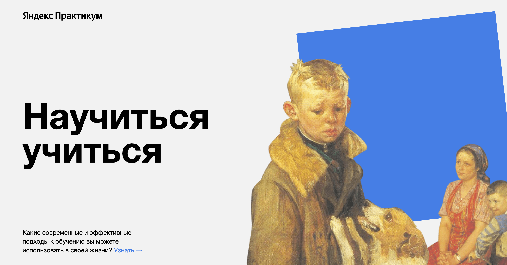

  

# Проект "Научиться учиться"
## В данном проекте затронуты главные проблемы в обучении, все подкреплено цифрами и фактами. Также описаны эффективные техники и методы обучения, а также указаны принципы обучения. Все это продемонтсрировано реальными примерами в формате текста, книг и видео. А также есть ссылки на полезные ресурсы.
## Здесь используются следующие технологии:
### -флексбокс-верстка;
### -позиционирование элементов;
### -bem nested;
### -семантические теги;
### -трансформации;
### -анимации.
## Планы по доработке проекта:
- подключить другие шрифты;
- добавить любимые образовательные видео;
- проверить код на кроссбраузерность и дописать все вендорные префиксы;
- задизайнить форму, через которую пользователи смогут отправить вам комментарий.
